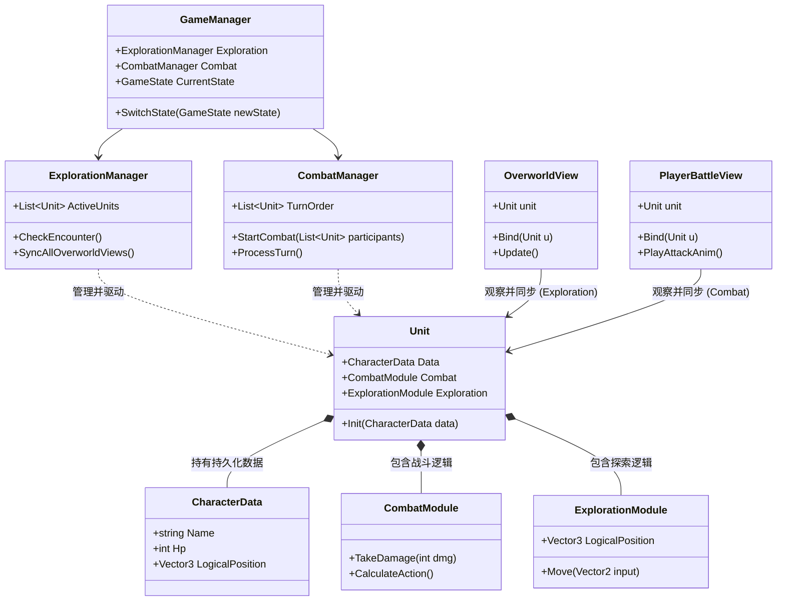

# 开发备忘录

## TODO

## Refactor

- [ ] 将 Unit 中的战斗相关数据分离到单独的类中 (`CharacterData`)
  1. 此外，`CharacterData`的本职工作不仅包括所有战斗相关的属性，所有所有跨场景、需要存档的持久化信息。探索相关的数据（比如位置、当前朝向、拥有的地图指令等级）也须存在这里。
  2. `CharacterData`在 Unit 当中是应该是一个只读属性，所有对其数据的修改都应通过 Unit 的方法来完成。
- [ ] 将`UnitView`重命名为`BattleUnitView`，将其特化为战斗专用，存放于 Comabat 文件下
  1. 这是因为之后，Combat 和 Exploration 会需要使用不同的 View 实现。

## 关于战斗、探索模块间关系的粗略设想

